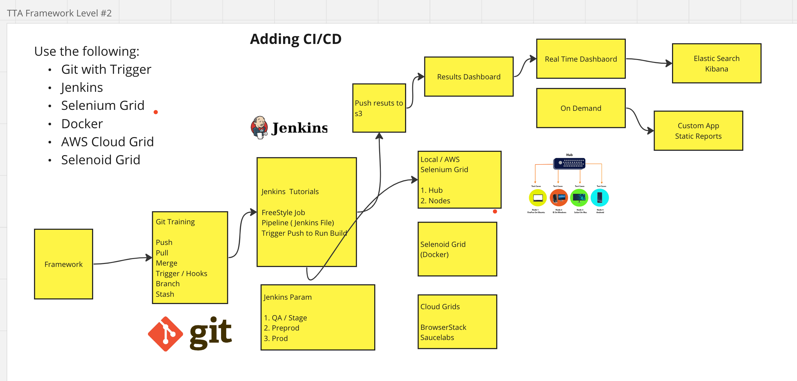
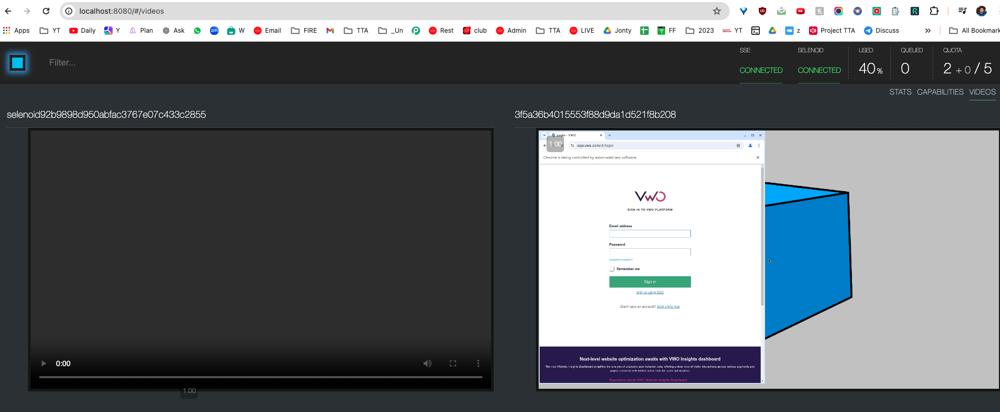

# Selenium Automation Framework(with Java)

Author - Devendra Bhambure

Java, Selenium, TestNG
Maven, AssertJ, POM
Thread Local Support → Thread Safety
Allure Report
Excel Sheet for Test Data → Data Provider
Read the username and password from Properties-
TestNG, @Test, Before and After Method.
Cloud Grids - Selenoid Docker integration
SonarLint, Java > 8
Run Local and on Selenoid Integration

Seleniod - Docker Grid Running
Selenoid is a powerful tool for running Selenium tests in Docker containers.
which can help you manage and scale your test automation infrastructure more efficiently.

